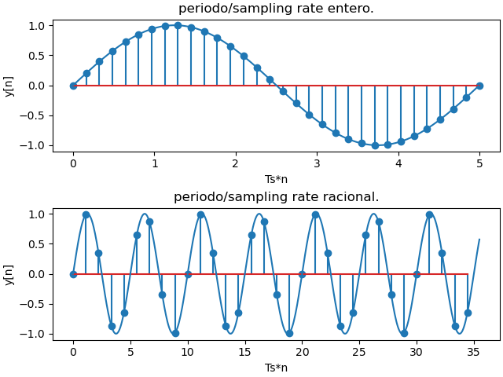

# Sampling Sins, Digital Signal Processing practice
First practice project while reading a book on digital signal processing.

Este es un pequeño proyecto para experimentar con el sampleo de señales periodicas, con el proposito de mostrar
graficamente que el periodo de una señal discreta depende del sampling rate y el periodo de la señal sampleada original.
El periodo de la señal original solo va a conservar si el periodo/sampling rate de la señal es entero, si es racional, el periodo de la señal original no se va a conservar.

Fuentes: 
[Alessio, 2016]  Alessio,  S.  M.  (2016).Digital  Signal  Processing  and  SpectralAnalysis for Scientists, pages 31–34. Springer International Publishing, Cham.
